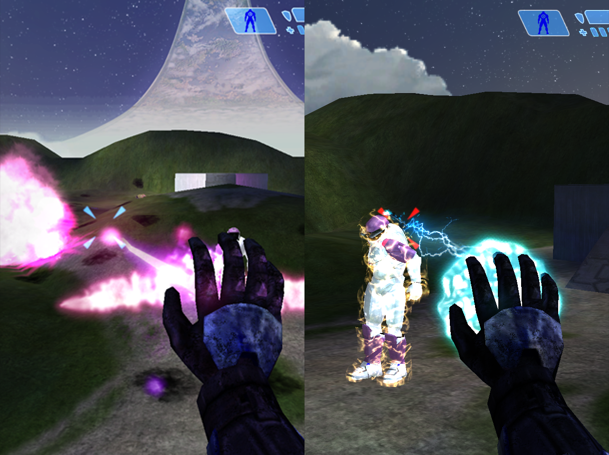

# Empezando en el modding

El modding se considera como cualquier alteración al videojuego que modifique dichos recursos, puede
efectuarse a diferentes niveles dependiendo de la complejidad del mod, en esta documentación
intetaremos cubrir los aspectos necesarios para que te adentres rapidamente en los terminos y 
conceptos que el juego utiliza, además de las herramientas utilizadas hoy día para la creación
de estos mods.

Al empezar dentro del mundo del modding de Halo Custom Edition encontrarás que requieres hacerte
con ciertos conocimientos sobre cómo se constituye el videojuego y sus recursos como archivos en
general, ejecutables, modelos, sonidos, texturas, etc.



```{warning}
Si aún no tienes instalado Halo Custom Edition, puedes descargarlo de
[aquí](https://drive.google.com/drive/folders/1-YzUse8f6pXqNgnQ2_s86IMCUmTEPWbl).
```
